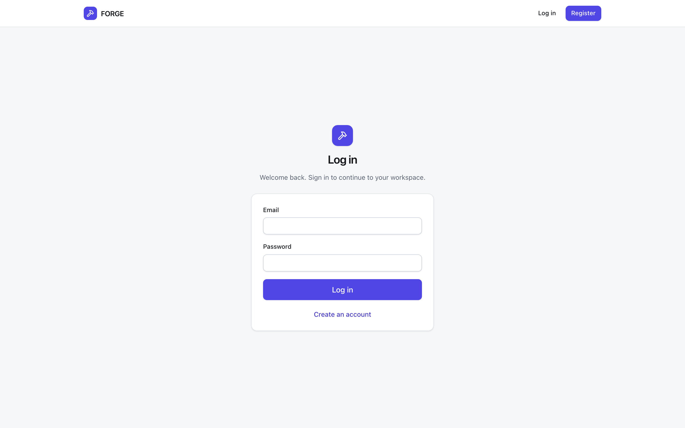
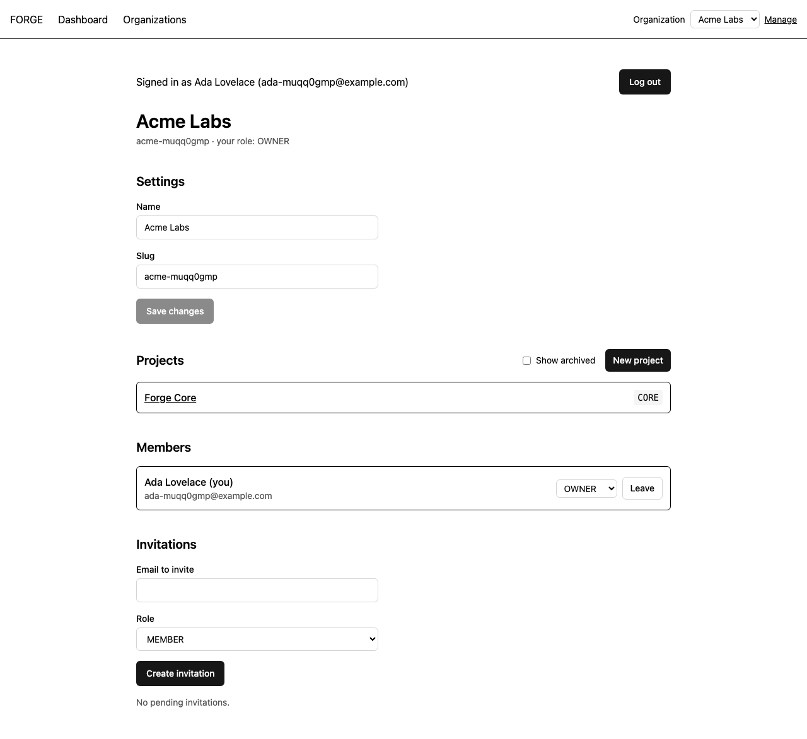
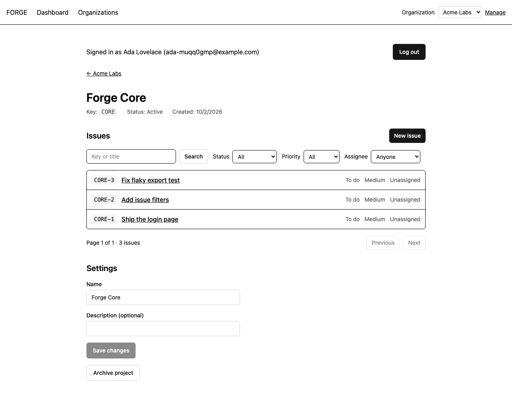
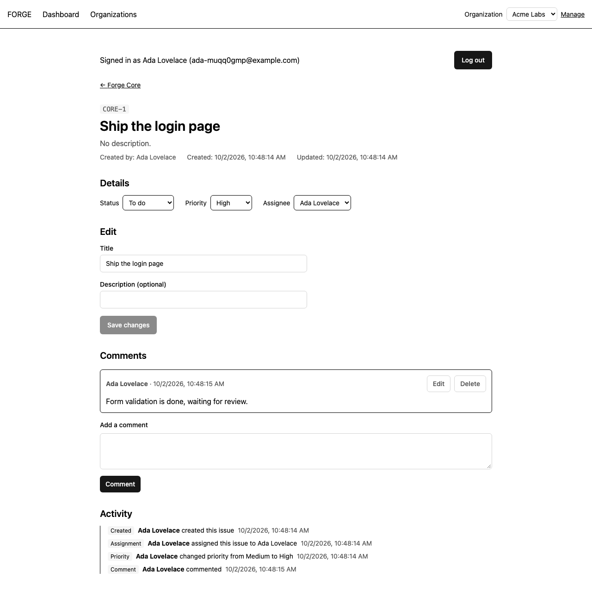
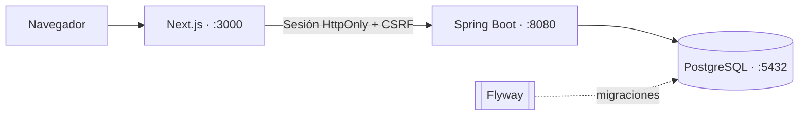

<div align="center">

# FORGE

**Gestión de proyectos para equipos pequeños: organizaciones, incidencias y actividad, de extremo a extremo.**


[Demo local](#probarlo-en-un-comando) · [Capturas](#capturas) · [Arquitectura](#arquitectura) · [Decisiones](#decisiones-de-diseño) · [Documentación](#documentación)

</div>

FORGE es un gestor de proyectos multiusuario inspirado en Linear y Jira, construido como ejercicio de ingeniería full stack: del modelo de datos a la interfaz, pasando por seguridad, pruebas, CI y un ensayo de despliegue en producción.

## Qué incluye

- **Organizaciones multiusuario** con roles `OWNER`, `ADMIN` y `MEMBER` e invitaciones que caducan.
- **Proyectos** con clave única por organización y archivado.
- **Incidencias** numeradas por proyecto (`CORE-1`, `CORE-2`…) con estado, prioridad y asignación.
- **Comentarios, historial de actividad, búsqueda con filtros y panel personal.**
- **Autenticación** con Spring Security: sesión HttpOnly + CSRF, contraseñas con BCrypt.

## Probarlo en un comando

> La demo pública no está desplegada. En su lugar, el entorno de producción se ensaya en local, con HTTPS incluido.

```bash
./deploy/deploy.sh   # HTTPS + frontend + API + base de datos, y comprobaciones de humo
```

Abre `https://app.forge.localhost:8443`, crea una cuenta y recorre el flujo: organización → proyecto → incidencia → asignación → comentarios → cambio de estado. Requiere Docker con Compose v2.

¿Prefieres desarrollar con recarga en caliente? Mira la [guía de desarrollo local](docs/development.md).

## Capturas

| Inicio de sesión | Organización |
| --- | --- |
|  |  |
| **Incidencias de un proyecto** | **Detalle de incidencia** |
|  |  |

Se regeneran con `SCREENSHOTS=1 E2E_BASE_URL=<url> npx playwright test screenshots` (desde `frontend/`).

## Arquitectura



- **Frontend**: Next.js 16 (App Router), React 19, TanStack Query, React Hook Form + Zod y componentes con convenciones shadcn/ui.
- **Backend**: Spring Boot 4 con Spring Security, validación y DTOs sin datos sensibles.
- **Datos**: PostgreSQL. Flyway es la única vía para cambiar el esquema; Hibernate solo lo valida.

## Decisiones de diseño

| Decisión | Por qué | Coste |
| --- | --- | --- |
| **Numeración de incidencias con contador por proyecto y bloqueo pesimista**, en vez de `MAX()+1` | Sin huecos ni duplicados, incluso con altas concurrentes (probado con 12 altas en 6 hilos) | Serializa las altas dentro de un mismo proyecto |
| **Sesión HttpOnly + CSRF** en vez de JWT en el navegador | Ningún token queda expuesto a JavaScript | Hay que configurar bien origen, cookies y `SameSite` entre dominios ([docs/azure.md](docs/azure.md)) |
| **Flyway como única vía de esquema** | Cambios versionados, revisables y reproducibles | Nunca se editan migraciones ya aplicadas |
| **Una organización ajena se comporta como inexistente (404)** | No filtra qué organizaciones existen | Los errores de acceso son menos explícitos |
| **Pruebas contra PostgreSQL real** (Testcontainers), no solo H2 | Detecta diferencias de SQL y restricciones reales | Requiere Docker para ejecutarlas |


## Limitaciones conocidas

- La búsqueda usa `LIKE`, sin índice de texto completo: suficiente para el volumen de demostración.
- Las sesiones viven en la memoria del backend y se pierden al reiniciarlo. No hay recuperación de contraseña, OAuth ni MFA.
- Las invitaciones no envían correo: el enlace se comparte a mano.
- Eliminar a un miembro de una organización no limpia sus asignaciones existentes.
- Los análisis de accesibilidad cubren las pantallas del recorrido E2E, no toda la interfaz.
- La URL de la API del frontend es fija en tiempo de build.

El seguimiento va en las [issues de GitHub](https://github.com/Cosmichomeless/FORGE/issues); no se promete ninguna extensión (Redis, WebSockets) sobre esta base.

## Calidad

- **Más de 100 tests de backend** (`mvn clean verify`): incluyen PostgreSQL real con Testcontainers y una matriz de roles.
- **Frontend**: lint, typecheck y Vitest.
- **E2E con Playwright** (`./scripts/e2e.sh`): recorre el flujo completo e incluye análisis de accesibilidad con axe en las pantallas del recorrido.
- **CI** en GitHub Actions: lint, typecheck, tests y build del frontend, y `mvn clean verify` del backend en cada PR. Los E2E no se ejecutan en CI.

## Documentación

| Documento | Contenido |
| --- | --- |
| [Desarrollo local](docs/development.md) | Requisitos, instalación, verificación y problemas frecuentes |
| [API y seguridad](docs/api.md) | Endpoints, roles, invitaciones y política de sesión |
| [Azure](docs/azure.md) | Arquitectura propuesta, configuración y checklist de despliegue |
| [Ficha de portfolio](docs/portfolio.md) | Resumen del proyecto |
| [Contribuir](CONTRIBUTING.md) | Ramas, Conventional Commits y Definition of Done |

## Estructura

```text
FORGE/
├── backend/       # Spring Boot, tests y migraciones Flyway
├── frontend/      # Next.js App Router, componentes y tests
├── deploy/        # Ensayo de producción: HTTPS, secretos, backup, smoke test
├── docs/          # API, desarrollo local, Azure y capturas
├── scripts/       # e2e.sh
├── .github/       # Plantillas de issues/PR y workflows de CI
└── compose.yaml   # PostgreSQL, API y frontend
```

## Despliegue

- **Ensayo de producción en local** (`./deploy/deploy.sh`): ingress HTTPS, cookies `Secure`, secretos generados, rol de BD sin privilegios, BD sin puertos expuestos, copia y restauración, y 11 comprobaciones de humo.
- **Azure** (Container Apps + PostgreSQL Flexible Server): arquitectura y configuración documentadas en [docs/azure.md](docs/azure.md). **No está desplegado**: no hay demo pública ni URL.

## Licencia

[MIT](LICENSE) · David Rodríguez.
