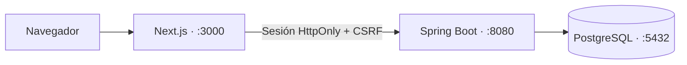

<div align="center">

# FORGE

**Un espacio de gestión de proyectos, construido paso a paso.**


</div>

FORGE es un proyecto full stack de portfolio inspirado en Linear/Jira. Actualmente incluye registro e inicio de sesión con Spring Security, un área privada básica, PostgreSQL local y migraciones. **Todavía no implementa organizaciones, proyectos ni tickets; no hay demo pública ni release de producción.**

## Arquitectura




El frontend usa TanStack Query, componentes con convenciones shadcn/ui y formularios de registro/login validados con React Hook Form + Zod. La sesión se resuelve con la API real; las funciones de gestión llegarán en las siguientes issues. Flyway es la única vía para cambiar el esquema; Hibernate solo lo valida.

## Requisitos

- JDK **25** y Maven **3.9+**. Confirma con java -version y mvn -v que Maven usa Java 25.
- Node.js **22.16+ dentro de la rama 22 LTS**, o **24 LTS**, npm **10+** (compatibles con Next.js y las herramientas de pruebas).
- Docker con el daemon activo y Docker Compose v2.
- Git. Puertos locales: frontend 3000, backend 8080 y PostgreSQL 5432.

Los comandos siguientes usan Bash/Zsh. En PowerShell, exporta las mismas variables con $env:VARIABLE y selecciona JAVA_HOME según tu instalación; no uses source.

## Instalación desde cero

1. Clona el repositorio:

```bash
git clone https://github.com/Cosmichomeless/FORGE.git
cd FORGE
```

2. Copia los ejemplos (nunca contienen credenciales reales):

```bash
cp .env.example .env
cp backend/.env.example backend/.env
cp frontend/.env.example frontend/.env.local
```

Edita .env y backend/.env: rellena DB_PASSWORD con una contraseña **local**, igual en ambos archivos. DB_USER también debe coincidir. Si cambias DB_PORT, ajusta el puerto de DB_URL en backend/.env. Configura NEXT_PUBLIC_API_URL con el origen de la API y APP_FRONTEND_ORIGIN con el de la interfaz (sin barra final). Usa localhost consistentemente; mezclarlo con 127.0.0.1 cambia origen y cookies. Cualquier NEXT_PUBLIC_* es visible en el navegador y no debe contener secretos.

Para esta guía local usa una contraseña aleatoria larga con letras, números, guiones y guiones bajos, sin espacios ni caracteres de shell como `$`, comillas o `;`. Así la asignación se interpreta igual en Docker Compose y al cargarla con `source`. Esta recomendación de formato es para el entorno local, no una política de contraseñas de usuarios.

3. Desde la raíz, inicia PostgreSQL:

```bash
docker compose config --quiet
docker compose up -d --wait db
```

Docker Compose lee el .env de la raíz automáticamente. La conexión se publica solo en 127.0.0.1 y los datos persisten en un volumen.

4. En otra terminal, desde la raíz, exporta la configuración e inicia la API:

```bash
set -a
source backend/.env
set +a
# Selecciona JDK 25 si Maven usa otra versión. En macOS:
export JAVA_HOME="$(/usr/libexec/java_home -v 25)"
mvn -v
(cd backend && mvn spring-boot:run)
```

Spring Boot **no carga .env automáticamente**: source exporta las variables para el proceso Maven. Usa solo un archivo local de confianza, ya que source ejecuta instrucciones de shell. La configuración base ya usa variables de entorno; no requiere activar un perfil local. Usa /actuator/health para comprobar la API.

5. En otra terminal, desde la raíz, inicia la interfaz:

```bash
cd frontend
npm ci
npm run dev
```

Abre http://localhost:3000. Desde la página inicial puedes ir a /register y /login. Tras iniciar sesión accedes a /dashboard, un área privada básica sin funciones de proyectos aún.

## Verificación

```bash
# Desde la raíz, con Maven usando JDK 25:
(cd backend && mvn clean verify)
(cd frontend && npm run lint && npm run typecheck && npm run test && npm run build)
curl --fail http://localhost:8080/actuator/health
```

El test del backend comprueba la salud con H2; no sustituye una prueba de integración con PostgreSQL. Para comprobar Flyway localmente, arranca la API dos veces con PostgreSQL y consulta desde la raíz:

```bash
docker compose exec db sh -c 'psql -U "$POSTGRES_USER" -d "$POSTGRES_DB" -c "SELECT version, success FROM flyway_schema_history;"'
```

V1 debe figurar una sola vez con success=true. No modifiques migraciones ya aplicadas: añade una nueva migración versionada.

## Parar los servicios

Detén frontend y backend con Ctrl+C en sus terminales. Desde la raíz, ejecuta docker compose down para detener la base sin eliminar el volumen. **No uses la opción -v si necesitas conservar los datos.**

## Problemas frecuentes

| Síntoma | Qué comprobar |
| --- | --- |
| release version 25 not supported | Maven usa otro JDK. Configura JAVA_HOME y confirma con mvn -v. En macOS: export JAVA_HOME="$(/usr/libexec/java_home -v 25)". |
| Docker no conecta | Abre Docker Desktop o inicia el daemon y verifica docker info. |
| Puerto 5432 ocupado | Cambia DB_PORT, por ejemplo a 55432, y el puerto de DB_URL antes del arranque. |
| DB_PASSWORD ausente o autenticación fallida | Rellena ambos ejemplos copiados y exporta backend/.env. Credenciales nuevas no cambian un volumen PostgreSQL ya inicializado. |
| Frontend en 3000 o API en 8080 ocupados | Detén únicamente el proceso que hayas identificado como propio, o configura un puerto alternativo. |
| Flyway informa de checksum diferente | Restaura la migración original y crea una nueva para cambios adicionales; no borres datos para ocultar el fallo. |

## Estructura

```text
FORGE/
├── backend/       # Spring Boot, tests y migraciones Flyway
├── frontend/      # Next.js App Router, componentes y tests
├── .github/       # Plantillas de issues y PR
├── compose.yaml   # PostgreSQL local
└── CONTRIBUTING.md
```

## Autenticación y seguridad

| Endpoint | Resultado |
| --- | --- |
| GET /api/v1/auth/csrf | Token y nombre de cabecera CSRF; accesible antes de login. |
| POST /api/v1/auth/register | JSON con name/email/password; 201 con id/name/email, 400 por validación o 409 por email duplicado. |
| POST /api/v1/auth/login | JSON con email/password; 200 con usuario y sesión, 401 por credenciales inválidas. |
| GET /api/v1/auth/me | Usuario actual o 401 si no hay sesión válida. |
| POST /api/v1/auth/logout | 204, sesión invalidada y cookie eliminada. |

Todas las operaciones POST requieren CSRF, incluso registro/login/logout. El cliente obtiene el token con credentials: include, envía la cabecera indicada y vuelve a obtenerlo para cada operación. El login cambia el ID de sesión y renueva CSRF. Las respuestas de autenticación no se almacenan en caché. No se guardan contraseñas ni tokens de sesión en localStorage.

La API usa BCrypt (coste 12), email normalizado y único en PostgreSQL, y devuelve DTOs sin hash. Registro admite nombre de 1–100 caracteres, email de hasta 254 y contraseña de 8–72 caracteres sin superar **72 bytes UTF-8**.

La cookie de sesión es HttpOnly y caduca tras 30 minutos de inactividad. COOKIE_SECURE=false y COOKIE_SAME_SITE=lax son solo los valores locales para HTTP. En despliegue HTTPS establece **COOKIE_SECURE=true**. Si frontend y API son cross-site, requiere COOKIE_SAME_SITE=none y HTTPS/Secure; CORS solo admite APP_FRONTEND_ORIGIN. Estas opciones no sustituyen la verificación del despliegue de las futuras issues de release.

El frontend resuelve /me antes de mostrar contenido privado y redirige al login si recibe 401. La autorización real se aplica en la API; el shell cliente no sustituye controles del servidor. Las sesiones viven en memoria del backend y se pierden al reiniciarlo. No hay todavía recuperación de contraseña, OAuth, MFA ni almacenamiento distribuido de sesiones.

### Tests de autenticación con PostgreSQL

La suite normal usa H2 y un servidor embebido para verificar cookies. AuthTests también puede ejecutarse contra PostgreSQL con AUTH_TEST_DB_URL, AUTH_TEST_DB_USER y AUTH_TEST_DB_PASSWORD. **Usa exclusivamente una base separada y desechable: esta clase elimina los usuarios entre tests. Nunca apuntes a desarrollo compartido o producción.**

```bash
# Variables exportadas previamente para una base PostgreSQL de pruebas dedicada:
(cd backend && mvn -Dtest=AuthTests test)
```

## Roadmap y contribuciones

Las issues de GitHub son la fuente de seguimiento. La siguiente etapa añade organizaciones, proyectos, tickets, colaboración y más pruebas. Docker del stack completo, CI y despliegue en Azure siguen pendientes. No se promete ninguna extensión (Redis/WebSockets) en esta base.

Consulta [CONTRIBUTING.md](CONTRIBUTING.md) para ramas cortas, Conventional Commits, comprobaciones y Definition of Done. Las plantillas de issues y PR están en .github/. Todavía no hay checks de CI configurados: ejecuta las comprobaciones manuales antes de solicitar revisión.

## Licencia

[MIT](LICENSE) · David Rodríguez.
