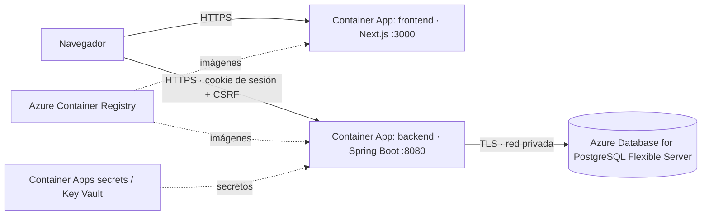

# FORGE en Azure: arquitectura, configuración y operación

> **Estado: propuesta documentada, NO desplegada en Azure; ensayada en local.**
> La carpeta [`deploy/`](../deploy) reproduce la topología de producción con Docker
> (ingress HTTPS, cookies `Secure`, secretos por entorno, rol de BD sin privilegios,
> backup/restore y smoke test). Ver [Ensayo local](#ensayo-local-de-producción).
>
> **Detalle del alcance:** No hay suscripción Azure ni CLI
> configurada en el entorno de desarrollo, por lo que nada de lo descrito aquí se ha
> ejecutado contra Azure. Lo verificable en local (imágenes, Compose, migraciones,
> copia y restauración con `pg_dump`/`pg_restore`) sí se ha probado y se indica.
> Las cifras de coste son **estimaciones aproximadas** a revisar con la calculadora de
> precios de Azure antes de crear recursos.

## Arquitectura propuesta



| Pieza | Servicio Azure | Motivo |
| --- | --- | --- |
| Frontend y API | Azure Container Apps (2 apps) | Ya existen Dockerfiles verificados; HTTPS gestionado, escala a 0 |
| Base de datos | PostgreSQL Flexible Server (Burstable B1ms) | Mismo motor que en local (PostgreSQL 17 recomendado), backups automáticos |
| Imágenes | Azure Container Registry (Basic) | Origen de imágenes de las apps |
| Secretos | Secretos de Container Apps (o Key Vault) | Evita credenciales en Git |
| Logs | Log Analytics (incluido con Container Apps) | Consulta de logs sin infraestructura extra |

Alternativa descartada: App Service. Funciona, pero obliga a dos planes o a empaquetar
distinto y no reutiliza las imágenes ya construidas.

## Entornos

- **local**: `docker compose up` (db + backend + frontend).
- **producción**: un único entorno. Para un proyecto de portfolio no se justifica
  un staging separado; el riesgo se mitiga con migraciones controladas y reversión (abajo).

## Costes estimados (aproximados, sin verificar)

| Recurso | Orden de magnitud mensual |
| --- | --- |
| PostgreSQL Flexible B1ms + 32 GB | ~15–25 € |
| Container Apps (consumo, escala a 0, tráfico bajo) | ~0–10 € |
| Container Registry Basic | ~4–5 € |
| Log Analytics (volumen bajo) | ~0–3 € |
| **Total** | **~20–40 €/mes** |

Límites: escala a 0 implica arranque en frío de varios segundos (Spring Boot); B1ms es
pequeño y adecuado solo para carga de demostración. Fija un presupuesto y alerta de coste.

## Configuración de producción (#64)

Nada de esto vive en Git; se inyecta como variable o secreto de cada Container App.

**Backend**

| Variable | Valor | Tipo |
| --- | --- | --- |
| `DB_URL` | `jdbc:postgresql://<servidor>.postgres.database.azure.com:5432/forge?sslmode=require` | secreto |
| `DB_USER` / `DB_PASSWORD` | usuario de aplicación (no el administrador) | secreto |
| `APP_FRONTEND_ORIGIN` | origen exacto del frontend, p. ej. `https://app.example.com` | variable |
| `COOKIE_SECURE` | `true` | variable |
| `COOKIE_SAME_SITE` | ver abajo | variable |
| `FORWARD_HEADERS_STRATEGY` | `framework` (el proxy de Azure termina TLS) | variable |

**Frontend**: `NEXT_PUBLIC_API_URL` se incrusta **en tiempo de build** (argumento de build
del Dockerfile). Cambiar la URL de la API exige reconstruir la imagen.

**Cookies y CORS.** La cookie de sesión es `HttpOnly`. Si frontend y API comparten dominio
registrable (`app.example.com` y `api.example.com`), `COOKIE_SAME_SITE=lax` basta y es lo
recomendable: usa un dominio propio. Si se usan los dominios por defecto
`*.azurecontainerapps.io`, los navegadores los tratan como sitios distintos y hará falta
`COOKIE_SAME_SITE=none` con `COOKIE_SECURE=true`. CORS y CSRF se limitan al origen indicado
en `APP_FRONTEND_ORIGIN`; no uses comodines.

## Base de datos y migraciones (#65)

- Acceso: Flexible Server con acceso privado (VNet integrada con el entorno de Container
  Apps) o, como mínimo, reglas de firewall solo para la API; sin `0.0.0.0/0`. TLS obligatorio.
- Usuarios: un administrador (solo operación) y un usuario de aplicación para el backend.
- **Migraciones**: Flyway se ejecuta al arrancar el backend (V1–V9). Para controlarlo,
  despliega primero una única réplica y revisa
  `SELECT version, success FROM flyway_schema_history;`. Nunca edites una migración ya
  aplicada; añade una nueva.
- **Copia y restauración**: además de los backups automáticos del servicio, copia manual:

```bash
pg_dump -h <servidor> -U <admin> -Fc forge > forge-$(date +%F).dump
createdb -h <servidor> -U <admin> forge_restore
pg_restore -h <servidor> -U <admin> -d forge_restore forge-<fecha>.dump
```

Este flujo `pg_dump -Fc` → `pg_restore` se ensayó en local con PostgreSQL 17 (tabla de
prueba restaurada con las mismas filas). **No se ha ensayado contra Azure.**

## Despliegue (#66)

Pasos previstos (no ejecutados):

1. Crear grupo de recursos, ACR, Log Analytics y entorno de Container Apps.
2. Crear el servidor PostgreSQL y el usuario de aplicación.
3. Construir y subir las imágenes (`backend/`, y `frontend/` con `--build-arg NEXT_PUBLIC_API_URL=https://<api>`).
4. Crear la app backend con variables/secretos y comprobar `/actuator/health`.
5. Crear la app frontend y verificar el flujo completo.

**Reversión**: mantener la revisión anterior de cada Container App (cambio de tráfico a la
revisión previa). Si una migración fue destructiva, restaurar desde la copia anterior al
despliegue; por eso se hace un `pg_dump` antes de cada release con migraciones.

## Salud, logs y verificación posterior (#67)

- Salud: solo se expone `/actuator/health` y sin detalles (`show-details: never`), sin
  datos sensibles. Es la sonda de la imagen Docker.
- Logs: salida estándar hacia Log Analytics. No se registran contraseñas ni cuerpos de
  petición; al consultar logs, revisa que no aparezcan correos u otros datos personales.

Lista de comprobaciones tras cada despliegue:

1. `curl --fail https://<api>/actuator/health` devuelve `{"status":"UP"}`.
2. El frontend carga por HTTPS y `/login` responde 200.
3. Registro, login y creación de organización/proyecto/incidencia funcionan (el recorrido
   automatizado equivalente está en `frontend/e2e/journey.spec.ts`).
4. `flyway_schema_history` sin migraciones fallidas.
5. Sin errores 5xx nuevos en Log Analytics durante los primeros minutos.

## Ensayo local de producción

`deploy/` simula, sin Azure, lo que se puede comprobar de #64–#67:

| Elemento real (Azure) | Simulación local |
| --- | --- |
| Ingress HTTPS gestionado | Caddy con CA interna: `https://app.forge.localhost:8443` y `https://api.forge.localhost:8443` |
| Secretos de Container Apps | `deploy/.env` generado con `openssl rand` (ignorado por Git) |
| Usuario administrador vs. de aplicación | `forge_admin` (solo operación) y `forge_app` (sin superusuario, dueño del esquema para Flyway) |
| Red privada hacia PostgreSQL | red Docker `internal`; la BD no publica ningún puerto en el host |
| Revisión anterior / reversión | backup automático previo (`backup.sh`) y `restore.sh` a una BD nueva |

```bash
./deploy/deploy.sh      # genera secretos, copia previa, build, up --wait y smoke test
./deploy/smoke.sh       # 11 comprobaciones posteriores al despliegue
E2E_BASE_URL=https://app.forge.localhost:8443 npm --prefix frontend run e2e
```

Resultado del ensayo (2 de octubre de 2026): las 11 comprobaciones pasan; el recorrido
E2E completo pasa sobre HTTPS con cookie `Secure`+`HttpOnly`; `pg_dump`/`pg_restore`
conservan 5 usuarios, 13 incidencias y 2 comentarios.

Hallazgos que el ensayo hizo cambiar en el código: Spring generaba un usuario en
memoria con contraseña aleatoria (no usado, pero ruidoso en logs y superficie
innecesaria) y se excluyó su autoconfiguración; el smoke test necesita esperar al proxy.

**Qué NO demuestra**: DNS y certificados reales, Key Vault, Log Analytics, redes
privadas de Azure, escala a 0 ni costes reales. `*.localhost` comparte sitio, por lo que
no ejercita el caso `SameSite=None` de los dominios `azurecontainerapps.io`.
