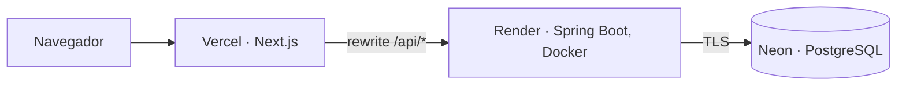

# Despliegue gratuito: Vercel + Render + Neon

> **Estado: preparado, NO desplegado.** La configuración está en el repositorio
> (`render.yaml`, `frontend/next.config.ts`) y el mecanismo de proxy se ha verificado en local, pero
> no se ha creado ninguna cuenta ni servicio. Los planes gratuitos cambian: confirma sus
> condiciones antes de empezar.

## Arquitectura



El navegador solo habla con el dominio de Vercel. Next.js reenvía `/api/*` a la API
(`rewrites` en `frontend/next.config.ts`), de modo que la cookie de sesión es de primera
parte y no la bloquean Safari ni los navegadores que restringen cookies de terceros.
Esto evita configurar `SameSite=None`.

| Pieza | Servicio | Por qué |
| --- | --- | --- |
| Frontend | Vercel (Hobby) | Gratis para uso personal; despliegue directo desde GitHub |
| API | Render (Free, Docker) | Reutiliza `backend/Dockerfile` sin cambios |
| Base de datos | Neon (Free) | PostgreSQL permanente; la BD gratuita de Render caduca |

## Pasos (en este orden)

1. **Neon**: crea un proyecto PostgreSQL. Copia la conexión **directa** (no la "pooled"):
   Flyway necesita una conexión normal. Formato para la API:
   `jdbc:postgresql://<host-directo>/<base>?sslmode=require`, más usuario y contraseña.
2. **Render**: *New → Blueprint* y elige este repositorio (`render.yaml`). Rellena
   `DB_URL`, `DB_USER` y `DB_PASSWORD`. Deja `APP_FRONTEND_ORIGIN` con un valor
   provisional; se corrige en el paso 4. Anota la URL pública de la API.
3. **Vercel**: importa el repositorio con *Root Directory* = `frontend` y estas variables:

   | Variable | Valor |
   | --- | --- |
   | `NEXT_PUBLIC_API_URL` | `/` (el navegador llama a su propio origen) |
   | `BACKEND_URL` | URL pública de la API en Render |

4. **Render**: pon `APP_FRONTEND_ORIGIN` = URL de Vercel (`https://<proyecto>.vercel.app`)
   y redespliega. Debe coincidir exactamente: el backend rechaza otros orígenes con 403.
5. **Verificación** (sustituye las URLs):

   ```bash
   curl -s https://<api>.onrender.com/actuator/health     # {"status":"UP"} (puede tardar ~1 min si estaba dormida)
   curl -si https://<proyecto>.vercel.app/api/v1/auth/csrf # 200 y Set-Cookie con HttpOnly y Secure
   ```

   Después, desde el navegador: registro, login, organización, proyecto, incidencia y comentario.

## Qué se ha verificado y qué no

- **Verificado en local**: con el frontend en modo producción (`BACKEND_URL` apuntando al
  API), registro, login y sesión (`/me`) funcionan a través del proxy `/api/*`. El Origin
  debe coincidir con `APP_FRONTEND_ORIGIN`.
- **No verificado**: Vercel, Render y Neon reales; certificados, tiempos de arranque y
  que `Set-Cookie` con `Secure` atraviese el proxy de Vercel igual que en local.

## Limitaciones del plan gratuito

- La API de Render se duerme tras unos 15 minutos sin tráfico; la primera visita tarda
  de 30 a 60 segundos. Neon también se suspende por inactividad.
- 512 MB de RAM en Render: `render.yaml` limita la JVM con `JAVA_TOOL_OPTIONS`. Si el
  arranque falla por memoria, es el primer sitio donde mirar.
- No hay copias automáticas con retención garantizada: es una demo, no un entorno de producción.
- Los logs de Render sustituyen a Log Analytics; no hay alertas.
