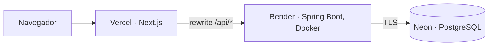

# Despliegue gratuito: Vercel + Render + Neon

> **Estado: desplegado y verificado el 7 de octubre de 2026** en
> https://forge-sandy-eta.vercel.app (API en `https://forge-api-plsr.onrender.com`). Los planes
> gratuitos cambian: confirma sus condiciones antes de repetir el proceso.

## Arquitectura



El navegador solo habla con el dominio de Vercel. Next.js reenvía `/api/*` a la API
(`rewrites` en `frontend/next.config.ts`), de modo que la cookie de sesión es de primera
parte y no la bloquean Safari ni los navegadores que restringen cookies de terceros.
Esto evita configurar `SameSite=None`.

| Pieza | Servicio | Por qué |
| --- | --- | --- |
| Frontend | Vercel (Hobby) | Gratis para uso personal; despliegue directo desde GitHub |
| API | Render (Free, Docker) | Reutiliza `backend/Dockerfile` sin cambios |
| Base de datos | Neon (Free) | PostgreSQL permanente; la BD gratuita de Render caduca |

## Pasos (en este orden)

1. **Neon**: crea un proyecto PostgreSQL. Copia la conexión **directa** (no la "pooled"):
   Flyway necesita una conexión normal. Formato para la API:
   `jdbc:postgresql://<host-directo>/<base>?sslmode=require`, más usuario y contraseña.
2. **Render**: *New → Blueprint* y elige este repositorio (`render.yaml`). Rellena
   `DB_URL`, `DB_USER` y `DB_PASSWORD`. Deja `APP_FRONTEND_ORIGIN` con un valor
   provisional; se corrige en el paso 4. Anota la URL pública de la API.
3. **Vercel**: importa el repositorio con *Root Directory* = `frontend` y estas variables:

   | Variable | Valor |
   | --- | --- |
   | `NEXT_PUBLIC_API_URL` | `/` (el navegador llama a su propio origen) |
   | `BACKEND_URL` | URL pública de la API en Render |

4. **Render**: pon `APP_FRONTEND_ORIGIN` = URL de Vercel (`https://<proyecto>.vercel.app`)
   y redespliega. Debe coincidir exactamente: el backend rechaza otros orígenes con 403.
5. **Verificación** (sustituye las URLs):

   ```bash
   curl -s https://<api>.onrender.com/actuator/health     # {"status":"UP"} (puede tardar ~1 min si estaba dormida)
   curl -si https://<proyecto>.vercel.app/api/v1/auth/csrf # 200 y Set-Cookie con HttpOnly y Secure
   ```

   Después, desde el navegador: registro, login, organización, proyecto, incidencia y comentario.

## Qué se ha verificado y qué no

Verificado el 7 de octubre de 2026 contra los servicios reales:

- `GET /actuator/health` de la API en Render devuelve `{"status":"UP"}`; Flyway aplicó las migraciones sobre Neon.
- `GET /api/v1/auth/csrf` a través de Vercel responde 200 con `Set-Cookie: JSESSIONID; Secure; HttpOnly; SameSite=Lax`.
- Registro (201), login (200) y `/me` (200 con sesión, 401 sin ella) a través del proxy de Vercel.
- El recorrido E2E `frontend/e2e/journey.spec.ts` (2 pruebas) pasa contra la URL pública:
  `E2E_BASE_URL=https://forge-sandy-eta.vercel.app npx playwright test e2e/journey.spec.ts`.

- `flyway_schema_history` en Neon: las migraciones V1–V9 con `success = t`.
- Copia y restauración ensayadas contra Neon (PostgreSQL 18.6): un `pg_dump -Fc` de la base
  real se restauró en un PostgreSQL 18 local desechable y conservó el historial de Flyway y
  los datos (2 usuarios, 1 incidencia, 1 comentario). Hay que usar un cliente de la misma
  versión mayor que el servidor (`pg_dump` 17 se niega a volcar un servidor 18):

  ```bash
  docker run --rm -e PGPASSWORD -e PGSSLMODE=require -v "$PWD:/out" postgres:18 \
    pg_dump -h <host-directo> -U <usuario> -d <base> -Fc --no-owner --no-privileges -f /out/forge.dump
  # restaurar en una base nueva (local o en otro proyecto de Neon):
  pg_restore -h <destino> -U <usuario> -d <base_nueva> --no-owner --no-privileges forge.dump
  ```

  El dump contiene datos de usuarios: guárdalo fuera de Git y bórralo tras la prueba.

- Logs de Render (arranque del 7 de octubre de 2026) y revisión del código: el arranque solo
  muestra versión, puertos y el host y nombre de la base de datos (sin usuario ni contraseña);
  el backend no tiene ninguna sentencia de log propia, ningún filtro de registro de peticiones
  ni `show-sql`, y el nivel es el INFO por defecto, de modo que no se registran correos,
  contraseñas ni cuerpos de petición. No se ha inspeccionado un tramo de logs con tráfico real.

No verificado: carga, copias de seguridad, alertas ni comportamiento tras semanas de suspensiones de Neon.

Nota: tras cambiar variables en Vercel hay que redesplegar y la CDN puede servir un 404 cacheado
unos minutos; con la propia respuesta de `x-vercel-cache: HIT` se reconoce.

## Limitaciones del plan gratuito

- La API de Render se duerme tras unos 15 minutos sin tráfico; la primera visita tarda
  de 30 a 60 segundos. Neon también se suspende por inactividad.
- 512 MB de RAM en Render: `render.yaml` limita la JVM con `JAVA_TOOL_OPTIONS`. Si el
  arranque falla por memoria, es el primer sitio donde mirar.
- **Acceso a la base de datos**: Neon Free expone un endpoint público protegido solo por TLS
  y contraseña; el filtrado por IP y las redes privadas son de planes de pago. Es un límite
  aceptado para esta demo, que solo contiene datos de prueba. En un entorno real habría que
  restringir el acceso por red y rotar la contraseña periódicamente.
- No hay copias automáticas con retención garantizada: es una demo, no un entorno de producción.
- Los logs de Render sustituyen a Log Analytics; no hay alertas.
